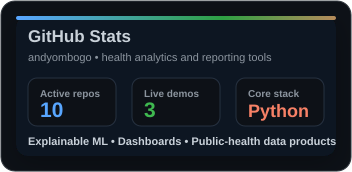
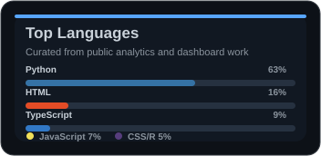

  <h1>John Andrew</h1>
  
<strong>Data Scientist building explainable health analytics, reporting copilots, and decision-support tools.</strong>

  

    
    
    
  

  

    
  

## What I Build

I turn messy public health and operational data into products people can understand, trust, and use. My work sits at the intersection of epidemiology, explainable machine learning, analytics engineering, and reporting automation.

- Health risk engines with interpretable outputs and practical deployment paths
- Dashboards that make program performance, data quality, and service delivery easier to act on
- AI-assisted reporting workflows that move teams from raw data to polished evidence faster
- Research-ready data pipelines for cleaning, validating, and comparing routine health data

## GitHub Streak

  

## GitHub Snapshot

  
  

## Featured Work

| Project | Why it matters |
| --- | --- |
| [Portfolio](https://andyombogo.github.io/) | A curated landing page for projects, demos, and professional work. |
| [Open Health Risk Engine](https://github.com/andyombogo/open-health-risk-engine) | Explainable health risk scoring with documentation, model governance, and a live calculator. |
| [AI Reporting Copilot](https://github.com/andyombogo/ai-reporting-copilot) | A reporting assistant workflow for loading data, configuring outputs, collaborating, refining, and exporting. |
| [MindMap Care](https://github.com/andyombogo/mindmap-care) | A care-focused analytics project for turning service data into clearer operational insight. |
| [KHIS Toolkit](https://github.com/andyombogo/khis-toolkit) | Utilities for cleaning and preparing routine health information system data. |

## Toolbox

Python, R, SQL, Streamlit, FastAPI, scikit-learn, DuckDB, GitHub Actions, data visualization, model documentation, and public health analytics.

## Current Focus

I am building practical AI and analytics systems for health teams: tools that explain themselves, respect data quality limits, and help decisions move with evidence instead of guesswork.
